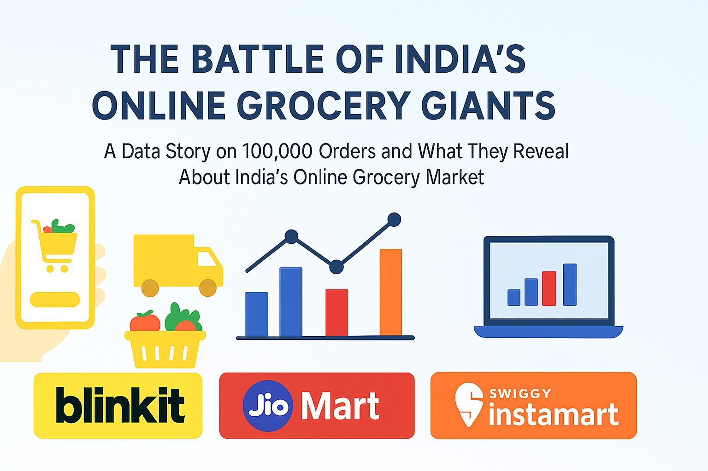

# 🛒 Online Grocery Market Analysis - Blinkit vs JioMart vs Swiggy Instamart  
### A Data-Driven Deep Dive into 100,000+ Orders in India’s Fast-Growing Quick-Commerce Market

<!-- 🖼️ Banner Image -->
<p align="center">
  
</p>

---

## 📋 Project Overview

This project analyzes **100,000+ online grocery orders** across India’s leading quick-commerce platforms:

- **Blinkit**
- **JioMart**
- **Swiggy Instamart**

The goal is to understand key aspects of the fast-growing online grocery market, including:

- Customer behavior  
- Delivery performance  
- Refund and cancellation trends  
- Platform competitiveness  

The analysis delivers **actionable, business-ready insights** backed by **Python-based analytics** and **visual storytelling**, helping decode how India’s quick-commerce ecosystem operates at scale.

---

## 🎯 Project Objectives

1. Identify order trends and top product categories  
2. Compare **Average Order Value (AOV)** across platforms  
3. Analyze delivery speed, delays, and operational efficiency  
4. Understand refund behavior and key triggers  
5. Study customer satisfaction using **service ratings**  
6. Provide **data-backed business recommendations** for quick-commerce growth
 

---

## 🧰 Tools & Technologies

| Category           | Tools Used                           |
|--------------------|---------------------------------------|
| Programming        | Python                                |
| Libraries          | pandas, numpy, seaborn, matplotlib    |
| Environment        | Jupyter Notebook                      |
| Version Control    | Git & GitHub                          |
| Visualization      | Seaborn & Matplotlib                  |


---

## 📊 Key Insights

| Area              | Insight                               | Business Takeaway                                 |
|-------------------|----------------------------------------|---------------------------------------------------|
| Delivery          | ~14% of orders face delays             | Improve routing efficiency & time-slot optimization |
| Refunds           | 46% of orders involve refunds          | Strengthen quality checks & packaging processes    |
| Customer Ratings  | Majority give 4–5 stars                | Maintain consistency to retain customer loyalty    |
| AOV               | Platforms have similar AOV (~₹590)     | Use upselling & bundling to boost revenue          |
| Product Trends    | Dairy & Grocery dominate               | Optimize inventory planning & SKU placement        |


---

## 📈 Visual Analysis Includes
- 📦 Orders by Platform and Product Category  
- 💰 Average Order Value (AOV) Comparison  
- ⏱️ Delivery Time Distribution & Delay Analysis  
- 💸 Refund Request Patterns  
- ⭐ Service Ratings Distribution  
- 🔗 Correlation Heatmap among Key Numeric Features 

**Note:** All visualization images are included in the `Images.zip` file in the root directory. Please unzip it locally to view the charts.

---

## 🧩 Methodology

1. **Data Cleaning & Sanitization**  
   - Removed corrupted timestamp column  
   - Validated categorical and numeric fields  

2. **Exploratory Data Analysis (EDA)**  
   - Conducted univariate and bivariate analysis  
   - Generated summary statistics and distributions  

3. **Visualization & Pattern Discovery**  
   - Created charts using Seaborn and Matplotlib  
   - Identified outliers and trends  

4. **Insight Derivation**  
   - Performed platform-level comparisons  
   - Analyzed customer behavior patterns  

5. **Business Interpretation**  
   - Formulated actionable recommendations backed by data  


---

## 🚀 How to Run This Project

**Requirements:** Python 3.8+ and Jupyter Notebook 

```bash
# Clone the repository
git clone https://github.com/disha-jais/online-grocery-analysis.git

# Navigate to the project folder
cd online-grocery-analysis

# Install dependencies
pip install -r requirements.txt

# Open the Jupyter Notebook
jupyter notebook notebook/analysis.ipynb
```

---
## 📁 Project Structure

```plaintext
online-grocery-analysis/
│
├── data/
│   └── data.csv             # Dataset used for analysis
│
├── notebook/
│   └── analysis.ipynb       # Jupyter notebook with code, visuals and insights
│
├── images/
│   └── charts.png           # Key visualization images
│
├── requirements.txt         # Python libraries needed to reproduce the project
│
└── README.md                # Project documentation
```

## 💬 Conclusion

This analysis highlights how:  

- **Speed** attracts customers  
- **Reliability** retains them  
- **Seamless refund processes** build trust  

Blinkit, JioMart, and Swiggy Instamart are extremely close competitors.  
However, the future leader will be the platform that optimizes:  

- Delivery consistency  
- SKU quality  
- Refund and replacement workflows  
- Personalized customer experiences  


---

## 📎 Future Enhancements

- 🤖 Predictive modeling (e.g., refund prediction or delivery delay prediction)  
- 👥 Customer segmentation using clustering techniques  
- 📊 Power BI / Tableau dashboard for interactive storytelling  
- 💬 Sentiment analysis on customer feedback  


---

## 👩‍💻 Author
**Disha Jaiswal**  
📧 [dishajaiswal057@gmail.com](mailto:dishajaiswal057@gmail.com)  
🔗 [LinkedIn](https://www.linkedin.com/in/disha-jais/)  
💻 [GitHub](https://github.com/disha-jais)


